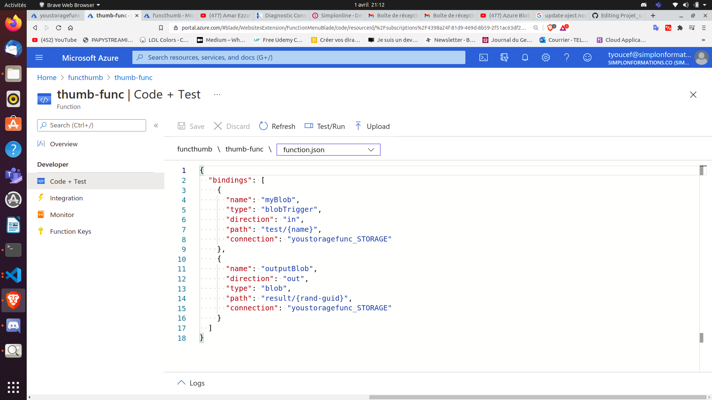
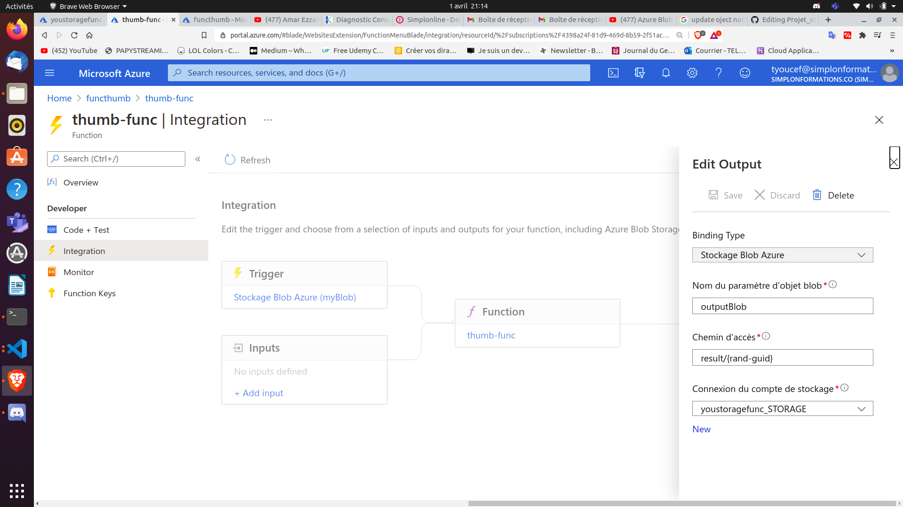
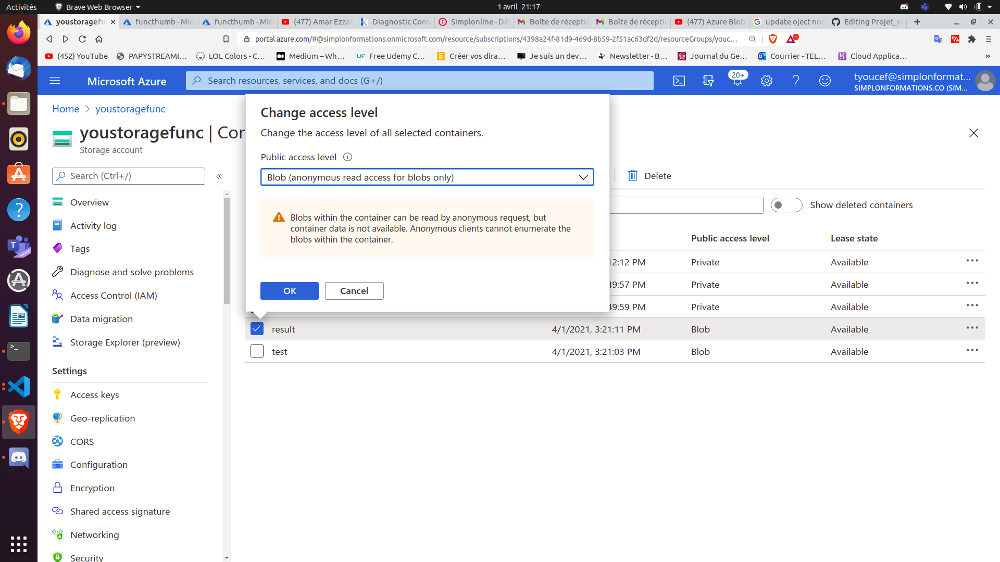

# Thumbnail

## Une révolution !!!

Je viens de créer l'application CopyGram, un réseau social permettant de partager des photos. Mon application fonctionne bien et les utilisateurs upload beaucoup de photos, ce qui rend malheureusement l'app de plus en plus lente. Car à chaque ouverture l'application charge toutes les photos qui sont visibles sur la page en haute qualité.

J'ai donc une idée de génie! Réduire la taille des images lorsque celles ci ne sont pas affichées en grand sur l'application. Quand l'utilisateur ouvrira l'application il verra des versions miniatures (thumbnail) des photos, et la version "normale" ne sera chargée que quand il cliquera dessus pour l'afficher en grand.

## Tech

Cette application utilise les technologies suivantes:

### Azure:

- [App-Function] - Microservice déployer sur des fonction serverless Azure
- [Storage-Account] - Stockage de données brut sur Azure

### Language:

- [JavaScript] - Utilisation des modules:
                    - Nodemailer Pour l'envoie des mails
                    - image-thumbnail pour le resize des images

## Installation

1- Créer un Storage Account sur Azure
2- Créer une App-function sur Azure:
====> Ajouter les functions dont on a besoin, bien choisir le type (blob, http ...), parametrer le chemin d'accés au upload file dans fonction.json et relier cette fonction a notre storage Account(integration > input/trigger).

====> Parametrer l'output de la fonction afin que celle ci nous envoie un rendu.

====> Parametrer les accès au container ou l'on veut uploader les fichiers en mode blob

## Developement

1- Pour améliorer le rendement de mon application je doit trouver une façon d'envoyer les images par mail

